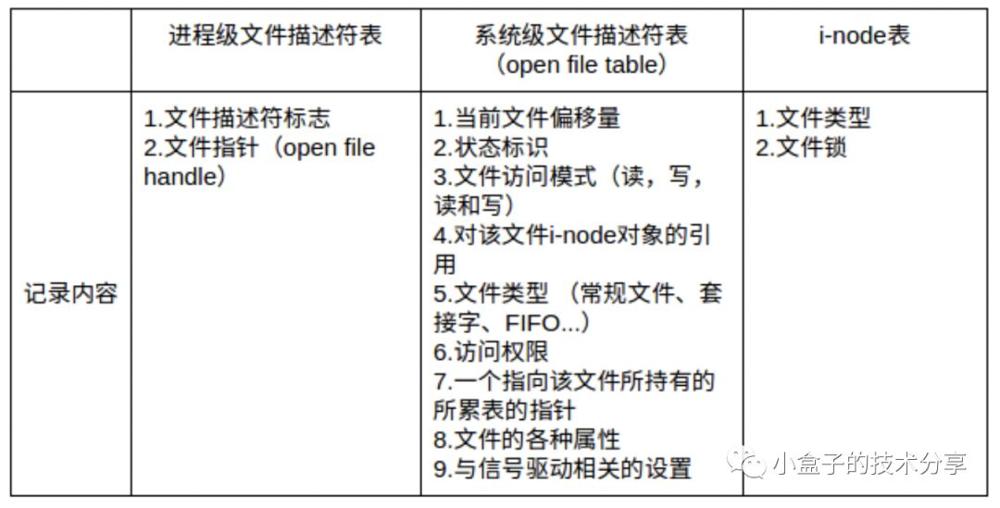
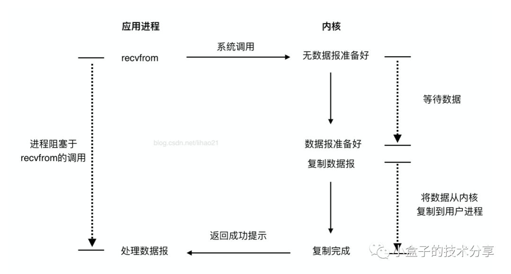
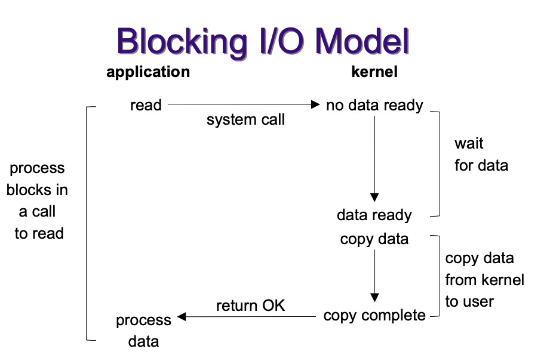
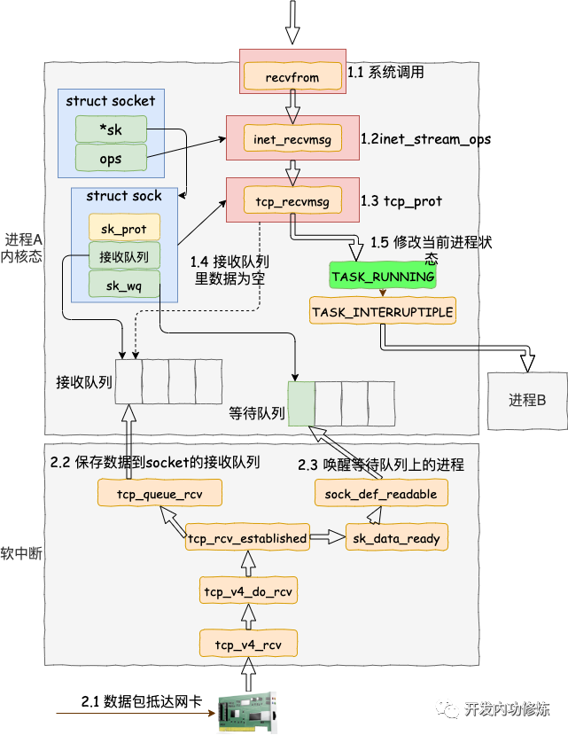
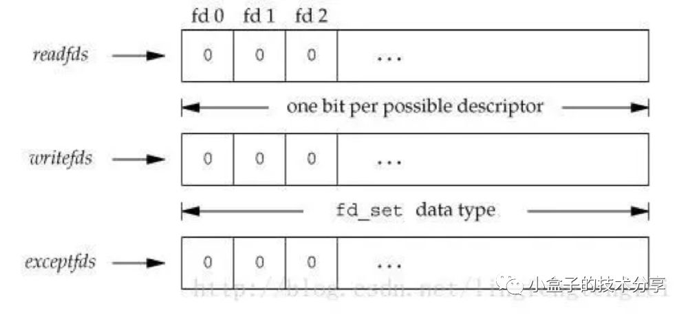
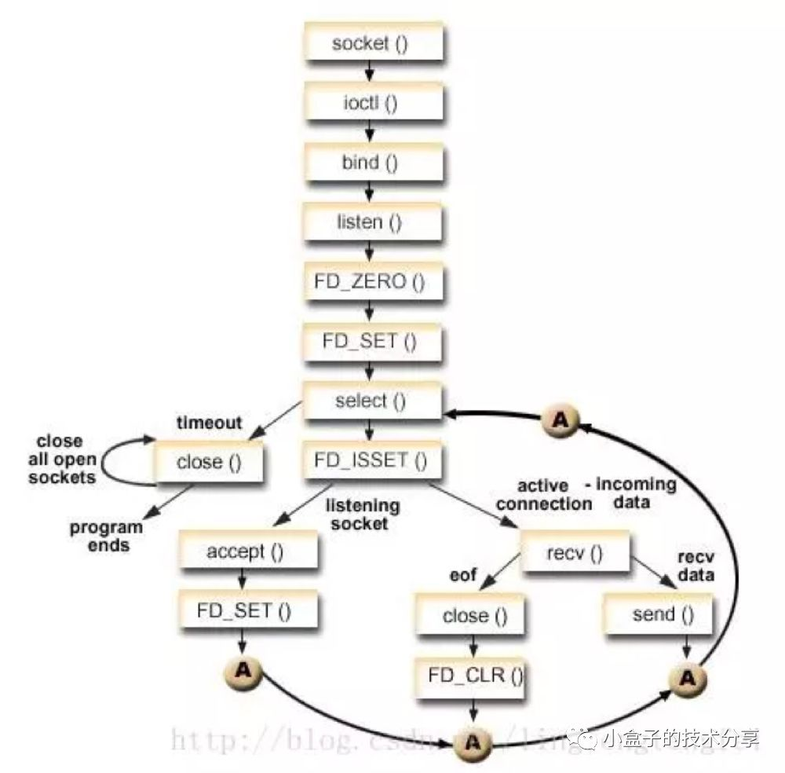
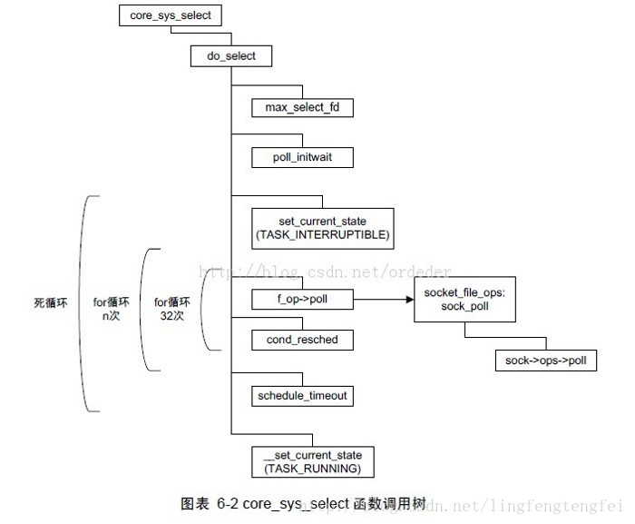
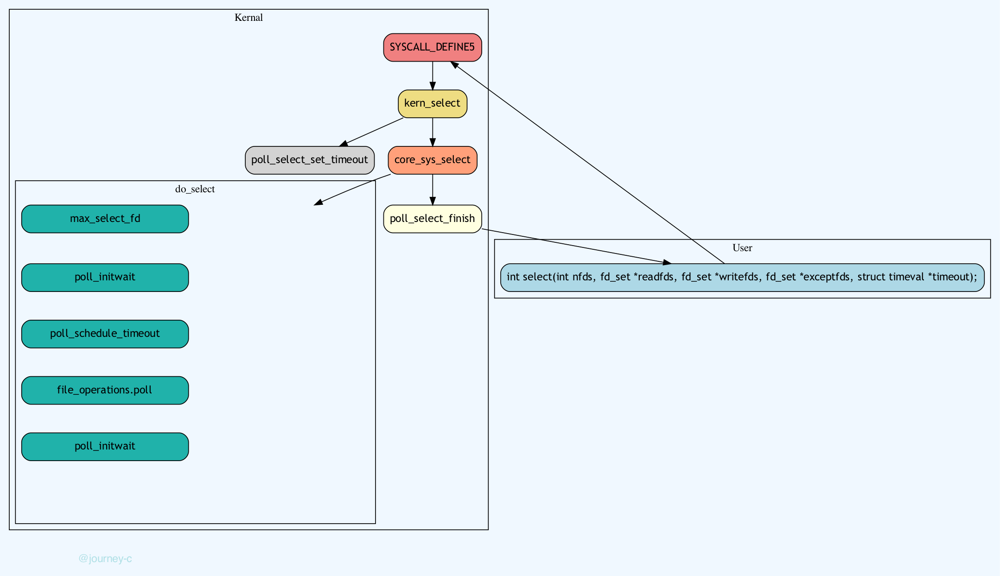
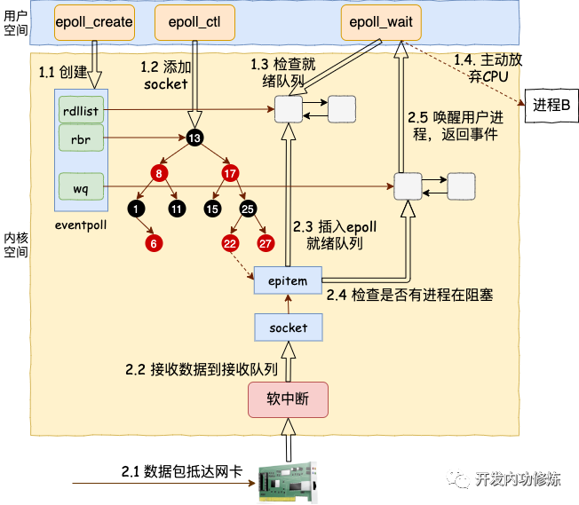

# Unix 网络 IO 模型

## 前知识&#x20;

### 文件描述符

**文件描述符**（file descriptor，简称 fd）在形式上是一个非负整数。实际上，它是一个索引值，指向内核为每一个进程所维护的该进程打开文件的记录表。当程序打开一个现有文件或者创建一个新文件时，内核向进程返回一个文件描述符。在程序设计中，一些涉及底层的程序编写往往会围绕着文件描述符展开。但是文件描述符这一概念往往只适用于UNIX、Linux这样的操作系统。

Linux平台万物皆文件


在 Linux 中，内核将所有的外部设备都当做一个文件来进行操作，而对一个文件的读写操作会调用内核提供的系统命令，返回一个 fd，对一个 socket 的读写也会有相应的描述符，称为 socketfd（socket 描述符），实际上描述符就是一个数字，它指向内核中的一个结构体（文件路径、数据区等一些属性）。如下图所示。


系统为维护文件描述符，建立了三个表

*   进程级的文件描述符表

*   系统级的文件描述符表

*   文件系统的i-node表&#x20;



实际工作中我们有时会碰到“Too many openfiles”的问题，那很可能就是进程可用的文件描述符过少的原因。然而很多时候，并不是因为进程可用的文件描述符过少，而是因为程序bug，打开了大量的文件连接（web连接也会占用文件描述符）而没有释放。**程序申请的资源在用完后要及时释放，才是解决“Too many open files”的根本之道。**

### 用户空间与内核空间、内核态与用户态

用户空间与内核空间，进程上下文与中断上下文【总结】，大概内容如下：

现在操作系统都是采用虚拟存储器，那么对32位操作系统而言，它的寻址空间（虚拟存储空间）为4G（2的32次方）。操作系统的核心是内核，独立于普通的应用程序，可以访问受保护的内存空间，也有访问底层硬件设备的所有权限。为了保证用户进程不能直接操作内核，**保证内核的安全，操作系统将虚拟空间划分为两部分，一部分为内核空间，一部分为用户空间。针对 linux 操作系统而言（以32位操作系统为例）**

将最高的 1G 字节（从虚拟地址0xC0000000 到 0xFFFFFFFF），供内核使用，称为内核空间；

将较低的 3G 字节（从虚拟地址0x00000000 到 0xBFFFFFFF），供各个进程使用，称为用户空间。

每个进程可以通过系统调用进入内核，因此，Linux 内核由系统内的所有进程共享。于是，从具体进程的角度来看，每个进程可以拥有 4G 字节的虚拟空间。

*   当一个任务（进程）执行系统调用而陷入内核代码中执行时，称进程处于内核运行态（内核态）。此时处理器处于特权级最高的（0级）内核代码中执行。当进程处于内核态时，执行的内核代码会使用当前进程的内核栈，每个进程都有自己的内核栈；

*   当进程在执行用户自己的代码时，则称其处于用户运行态（用户态）。此时处理器在特权级最低的（3级）用户代码中运行。当正在执行用户程序而突然被中断程序[中断]时，此时用户程序也可以象征性地称为处于进程的内核态。因为中断处理程序将使用当前进程的内核栈。

## IO 模型&#x20;

根据 UNIX 网络编程对IO 模型的分类，UNIX 提供了以下 5 种 IO 模型。


### 阻塞式 IO(Blocking IO)

最流行的 IO 操作是阻塞式 **IO(Blocking IO)**. 以 UDP 数据报套接字为例,下图是其阻塞 IO 的调用过程:



上图有个**recvfrom**调用，这是啥？recvfrom是C语言的函数，也就是linux内核函数（操作系统也是用编程语言写的嘛），所以可想而知我们上层不管用什么语言写的应用，最终的调用是会执行操作系统内核的函数的。而recvfrom函数，大致含义是：从（已连接）套接口上接收数据，并捕获数据发送源的地址。假如套接字上没有消息可以读取，除非套接字已被设置为非阻塞模式，否则接收调用会等待消息的到来。

如上图中所示的一样,recvfrom使进程阻塞，它是一个阻塞函数。我们以套接字接口为例来讲解此模型，在进程空间中调用recvfrom,其系统调用直到数据包到达且被复制到应用进程的缓冲区中或者发生错误时才返回，在此期间一直会等待，进程在从调用recvfrom开始到它返回的整段时间内都是被阻塞的，因此被称为阻塞IO模型。如上文所述，阻塞I/O下请求无法立即完成则保持阻塞。阻塞I/O分为如下两个阶段。

*   阶段1：等待数据就绪。网络 I/O 的情况就是等待远端数据陆续抵达；磁盘I/O的情况就是等待磁盘数据从磁盘上读取到内核态内存中。

*   阶段2：数据拷贝。出于系统安全，用户态的程序没有权限直接读取内核态内存，因此内核负责把内核态内存中的数据拷贝一份到用户态内存中。

**传统的阻塞I/O，对一个文件描述符操作(FD)时，如果操作没有响应就会一直等待，直到内核有反馈。缺点就是单线程一次只能操作一个FD**





### 非阻塞式IO模型

**非阻塞式IO模型**，如下图所示:


非阻塞I/O请求包含如下三个阶段

*   **阶段1**：socket设置为 NONBLOCK（非阻塞）就是告诉内核，当所请求的I/O操作无法完成时，不要将线程睡眠，而是返回一个错误码(EWOULDBLOCK) ，这样请求就不会阻塞。

*   **阶段2**：I/O操作函数将不断的测试数据是否已经准备好，如果没有准备好，继续测试，直到数据准备好为止。整个I/O 请求的过程中，虽然用户线程每次发起I/O请求后可以立即返回，但是为了等到数据，仍需要不断地轮询、重复请求，消耗了大量的 CPU 的资源。

*   **阶段3**：数据准备好了，从内核拷贝到用户空间。

总结来说，recvfrom 从应用到内核态时，如果该缓冲区没有数据，就会直接返回EWOULDBLOCK 错误，一般都对非阻塞 IO 模型进行轮询检查这个状态，看看内核是不是有数据到来也就是说非阻塞的 recvform 系统调用调用之后，进程并没有被阻塞，内核马上返回给进程。如果数据还没准备好，此时会返回一个 error。进程在返回之后，可以干点别的事情，然后再发起 recvform 系统调用。重复上面的过程，循环往复的进行 recvform 系统调用，这个过程通常被称之为轮询。轮询检查内核数据，直到数据准备好，再拷贝数据到进程，进行数据处理。需要注意，拷贝数据整个过程，进程仍然是属于阻塞的状态。

在 Linux 下，可以通过设置socket 使其变为 non-blocking。非阻塞IO过于消耗CPU时间，将大部分时间用于轮询。

### IO 多路复用

**多路复用实际不是一个技术而是一个理念，在I/O多路复用之前就有通讯线路的频分复用和时分复用，大概就是合理的安排每个单位使用资源的时间和位置，看起来所有单位一起在使用原本只能允许少量单位同时使用的资源。**

> 多路是指网络连接，复用指的是同一个线程

**I/O multiplexing**   multiplexing一词其实多用于通信领域，为了充分利用通信线路，希望在一个信道中传输多路信号，要想在一个信道中传输多路信号就需要把这多路信号结合为一路，将多路信号组合成一个信号的设备被称为multiplexer，显然接收方接收到这一路组合后的信号后要恢复原先的多路信号，这个设备被称为demultiplexer，如图所示：


**IO 多路复用模型**，如下图所示：


上图中有个select函数，我们先来解释下这个函数:

**基本原理：** select 函数监视的文件描述符分3类，分别是writefds、readfds、和exceptfds。调用后select函数会阻塞，直到有描述符就绪（有数据 可读、可写、或者有except），或者超时（timeout指定等待时间，如果立即返回设为null即可），函数返回。当select函数返回后，可以通过遍历fdset，来找到就绪的描述符。

```c
// 返回值：做好准备的文件描述符的个数，超时为0，错误为-1.
#include <sys/select.h>
#include <sys/time.h>

#define FD_SETSIZE 1024
#define NFDBITS (8 * sizeof(unsigned long))
#define __FDSET_LONGS (FD_SETSIZE/NFDBITS)

// 数据结构 (bitmap)
typedef struct {
    unsigned long fds_bits[__FDSET_LONGS];
} fd_set;

// API
int select(
    int max_fd, 
    fd_set *readset, 
    fd_set *writeset, 
    fd_set *exceptset, 
    struct timeval *timeout
)                              // 返回值就绪描述符的数目

FD_ZERO(int fd, fd_set* fds)   // 清空集合
FD_SET(int fd, fd_set* fds)    // 将给定的描述符加入集合
FD_ISSET(int fd, fd_set* fds)  // 判断指定描述符是否在集合中 
FD_CLR(int fd, fd_set* fds)    // 将给定的描述符从文件中删除 

```

Select总共三部分参数

1.  传入FD(文件描述符)最大的+1

2.  传入的FD，分三类

    *   1\). 监听读

    *   2\). 监听写

    *   3\). 监听异常

3.  如果一直没有满足条件的fd，最多等多久(超时时间)

select用一个`FD_SETSIZE`位的BitMap表示输入参数，`FD_SETSIZE`默认为1024。因为没有1024位那么长的数，所以用一个数组表示，因为数组元素地址连续，所以实际就是一个1024位的数，比如第1位为1，表示这次输入有fd1(标准输出fd)。这个地方也限制了`select最多支持1024个fd，并且fd的号码不能大于等于1024。`

一个文件描述集保存在fd\_set类型当中，fd\_set类型变量的每一位代表了一个描述符。我们也可以认为它只是由一个很多二进制位构成的数组



在Linux中，我们可以使用select函数实现I/O端口的复用，传递给 select函数的参数会告诉内核：

•  我们所关心的文件描述符

•  对每个描述符，我们所关心的状态。(我们是要想从一个文件描述符中读或者写，还是关注一个描述符中是否出现异常)

•  我们要等待多长时间。(我们可以等待无限长的时间，等待固定的一段时间，或者根本就不等待)

从 select函数返回后，内核告诉我们以下信息：

•  对我们的要求已经做好准备的描述符的个数

•  对于三种条件哪些描述符已经做好准备.(读，写，异常)

select 函数告诉我们，**当有读写事件发生的时候，有多少个事件就绪，但是他不会告诉我们具体是哪些事件就绪，需要我们自己去事件集一个一个遍历判断。** 有了这些返回信息，我们可以调用合适的I/O函数(通常是 read 或 write)，并且这些函数不会再阻塞。

**select具有O(n)的无差别轮询复杂度**，同时处理的流越多，无差别轮询时间就越长。

基本流程如下图



> 调用顺序如下：sys\_select() → core\_sys\_select() → do\_select() → fop->poll()






如果你对上面那一坨理论不感冒的话，那我们简明的总结一下\*\*，使用select以后最大的优势是用户可以在一个线程内同时处理多个socket的IO请求。用户可以注册多个socket，然后不断地调用select读取被激活的socket，即可达到在同一个线程内同时处理多个IO请求的目的。而在同步阻塞模型中，必须通过多线程的方式才能达到这个目的。\*\*

再来看个select流程伪代码：


对，就是顾名思义不断去select处于可用状态的socket。你可能会说使用select函数进行IO请求和同步阻塞模型没有太大的区别，甚至还多了添加监视socket，以及调用select函数的额外操作，效率更差。但是，使用select以后最大的优势是用户可以在一个线程内同时处理多个socket的IO请求。如果你的网络请求量比较大的情况下，这种模式是不是比阻塞式好啊。

**总结一下IO多路复用模型**：IO multiplexing（多路复用）就是我们说的select，poll，epoll（关于这三个函数的对比和介绍，后文再讲），有些地方也称这种IO方式为event driven （事件驱动）IO。

**select/epoll的好处就在于单个process就可以同时处理多个网络连接的IO**。**I/O多路复用技术的最大优势是系统开销小，系统不必创建进程/线程，也不必维护这些进程/线程，从而大大减小了系统的开销**。它的基本原理就是select，poll，epoll这个function会不断的轮询所负责的所有socket，当某个socket有数据到达了，就通知用户进程。

当用户进程调用了select，那么整个进程会被block，而同时，kernel会“监视”所有select负责的socket，当任何一个socket中的数据准备好了，select就会返回。这个时候用户进程再调用read操作，将数据从kernel拷贝到用户进程。所以，**I/O 多路复用的特点是通过一种机制一个进程能同时等待多个文件描述符，而这些文件描述符（套接字描述符）其中的任意一个进入读就绪状态，select()函数就可以返回**。

上面这个图和blocking IO的图其实并没有太大的不同，事实上，还更差一些。因为这里需要使用两个systemcall (select 和 recvfrom)，而blockingIO只调用了一个system call (recvfrom)。但是，用select的优势在于它可以同时处理多个connection。所以，如果处理的连接数不是很高的话，使用select/epoll的web server不一定比使用multi-threading + blocking IO的web server性能更好，可能延迟还更大。**select/epoll的优势并不是对于单个连接能处理得更快，而是在于能处理更多的连接**。）

在IO multiplexing Model中，实际中，对于每一个socket，一般都设置成为non-blocking，但是，如上图所示，整个用户的process其实是一直被block的。**只不过process是被select这个函数block，而不是被socket IO给block**。

**select本质上是通过设置或者检查存放fd标志位的数据结构来进行下一步处理**。这样所带来的**缺点**是：

1.  单个进程可监视的fd数量被限制，即能监听端口的大小有限。一般来说这个数目和系统内存关系很大，具体数目可以cat/proc/sys/fs/file-max察看。32位机默认是1024个。64位机默认是2048.

2.  对socket进行扫描时是线性扫描，即采用轮询的方法，效率较低：当套接字比较多的时候，每次select()都要通过遍历FD\_SETSIZE个Socket来完成调度,不管哪个Socket是活跃的,都遍历一遍。这会浪费很多CPU时间。如果能给套接字注册某个回调函数，当他们活跃时，自动完成相关操作，那就避免了轮询，这正是epoll与kqueue做的。

3.  需要维护一个用来存放大量fd的数据结构，这样会使得用户空间和内核空间在传递该结构时复制开销大。

### 信号驱动式I/O模型

这种模式一般很少用，所以不重点说了，大概说一下，如图所示：


为了使用该I/O模型，需要开启套接字的信号驱动I/O功能，并通过sigaction系统调用安装一个信号处理函数。sigaction函数立即返回，我们的进程继续工作，即进程没有被阻塞。当数据报准备好时，内核会为该进程产生一个SIGIO信号，这样我们可以在信号处理函数中调用recvfrom读取数据报，也可以在主循环中读取数据报。无论如何处理SIGIO信号，这种模型的优势在于等待数据报到达期间不被阻塞。

来看下这种模式的缺点：信号 I/O 在大量 IO 操作时可能会因为信号队列溢出导致没法通知。信号驱动 I/O 尽管对于处理 UDP 套接字来说有用，即这种信号通知意味着到达一个数据报，或者返回一个异步错误。但是，对于 TCP 而言，信号驱动的 I/O 方式近乎无用，因为导致这种通知的条件为数众多，每一个来进行判别会消耗很大资源，与前几种方式相比优势尽失。

### 异步IO模型


调用aio\_read 函数(当然AIO的API不止这一个，如下图还有很多)，


告诉内核描述字，缓冲区指针，缓冲区大小，文件偏移以及通知的方式，然后立即返回。当内核将数据拷贝到缓冲区后，再通知应用程序。所以异步I/O模式下，阶段1和阶段2全部由内核完成，完成不需要用户线程的参与。

**异步 IO 模型和信号驱动的 IO 模型的主要区别在于: 信号驱动 IO 是由内核通知我们何时可以启动一个 IO 操作, 而异步 IO 模型是由内核通知我们 IO 操作何时完成。**

## 比较&#x20;

到此我们已经分别介绍完了5种IO模型，来看一下他们的比较：


可以看到，前四种I/O模型的主要区别在于第一个阶段，它们的第二个阶段是一样的：在数据从内核复制到应用进程的缓冲区期间，进程会被阻塞于recvfrom系统调用。而异步I/O模型则是整个操作完成内核才通知应用进程。

***

**下面引用知乎上有一个比较生动的例子可以说明这几种模型之间的关系。**

老张爱喝茶，废话不说，煮开水。

出场人物：老张，水壶两把（普通水壶，简称水壶；会响的水壶，简称响水壶）。 &#x20;
\*\*1 老张把水壶放到火上，立等水开。（同步阻塞） &#x20;
\*\*老张觉得自己有点傻 &#x20;
\*\*2 老张把水壶放到火上，去客厅看电视，时不时去厨房看看水开没有。（同步非阻塞） &#x20;
\*\*老张还是觉得自己有点傻，于是变高端了，买了把会响笛的那种水壶。水开之后，能大声发出嘀\~\~\~\~的噪音。 &#x20;
\*\*3 老张把响水壶放到火上，立等水开。（异步阻塞） &#x20;
\*\*老张觉得这样傻等意义不大 &#x20;
\*\*4 老张把响水壶放到火上，去客厅看电视，水壶响之前不再去看它了，响了再去拿壶。（异步非阻塞） &#x20;
\*\*老张觉得自己聪明了。

所谓同步异步，只是对于水壶而言。  普通水壶，同步；响水壶，异步。 &#x20;

虽然都能干活，但响水壶可以在自己完工之后，提示老张水开了。这是普通水壶所不能及的。 &#x20;

同步只能让调用者去轮询自己（情况2中），造成老张效率的低下。

所谓阻塞非阻塞，仅仅对于老张而言。 &#x20;

立等的老张，阻塞；看电视的老张，非阻塞。 &#x20;

情况1和情况3中老张就是阻塞的，媳妇喊他都不知道。虽然3中响水壶是异步的，可对于立等的老张没有太大的意义。所以一般异步是配合非阻塞使用的，这样才能发挥异步的效用。

***

## 多路复用之select、poll、epoll

上文中提到的多路复用模型的图中只画了select，实际上这种模型的实现方式是可以基于不同方法有多个实现的。比如基于 `select` 或`poll`或`epoll`方法，那么它们有什么不同呢？

### select

select函数监视的 fd 分3类，分别是 writefds、readfds、和exceptfds。调用后select 函数会阻塞，直到有fd 就绪（有数据 可读、可写、或者有 except），或者超时（timeout 指定等待时间，如果立即返回设为 null 即可），函数返回。当select函数返回后，可以通过遍历 fdset，来找到就绪的 fd。

select目前几乎在所有的平台上支持，其良好跨平台支持也是它的一个优点。select 的一个最大的缺陷就是单个进程对打开的 fd 是有一定限制的，它由 FD\_SETSIZE 限制，默认值是1024，如果修改的话，就需要重新编译内核，不过这会带来网络效率的下降。

### poll

poll 本质上和 select 没有区别，它将用户传入的数组拷贝到内核空间，然后查询每个 fd 对应的设备状态，如果设备就绪则在设备等待队列中加入一项并继续遍历，如果遍历完所有 fd 后没有发现就绪设备，则挂起当前进程，直到设备就绪或者主动超时，被唤醒后它又要再次遍历 fd。这个过程经历了多次无谓的遍历。它没有最大连接数的限制，原因是它是基于链表来存储的，但是同样以下几个缺点：

1 大量的 fd 的数组被整体复制于用户态和内核地址空间之间；

2 poll还有一个特点是【[**水平触发**]】，**如果报告了 fd 后，没有被处理，那么下次 poll 时会再次报告该 fd；**

3 fd 增加时，线性扫描导致性能下降。

select和 poll 另一个缺陷就是随着 fd 数目的增加，可能只有很少一部分 socket 是活跃的，但是 select/poll 每次调用时都会线性扫描全部的集合，导致效率呈现线性的下降。

### 水平触发和边缘触发

**水平触发(level-trggered)**

只要文件描述符关联的读内核缓冲区非空，有数据可以读取，就一直发出可读信号进行通知，当文件描述符关联的内核写缓冲区不满，有空间可以写入，就一直发出可写信号进行通知LT模式支持阻塞和非阻塞两种方式。epoll默认的模式是LT。

**边缘触发(edge-triggered)**

当文件描述符关联的读内核缓冲区由空转化为非空的时候，则发出可读信号进行通知，当文件描述符关联的内核写缓冲区由满转化为不满的时候，则发出可写信号进行通知。两者的区别在哪里呢？水平触发是只要读缓冲区有数据，就会一直触发可读信号，而边缘触发仅仅在空变为非空的时候通知一次，

LT(leveltriggered)是缺省的工作方式，并且同时支持block和no-blocksocket.在这种做法中，内核告诉你一个文件描述符是否就绪了，然后你可以对这个就绪的fd进行IO操作。如果你不作任何操作，内核还是会继续通知你的，所以，这种模式编程出错误可能性要小一点。传统的select/poll都是这种模型的代表。

### epoll

epoll是在2.6内核中提出的，是之前的select和poll的增强版本。相对于select和poll来说，epoll更加灵活，没有描述符限制。epoll使用一个文件描述符管理多个描述符，将用户关系的文件描述符的事件存放到内核的一个事件表中，这样在用户空间和内核空间的copy只需一次。

epoll 支持水平触发和边缘触发，最大的特点在于边缘触发，它只告诉进程哪些 fd 变为就绪态，并且只会通知一次。还有一个特点是，epoll 使用【**事件**】的就绪通知方式，通过 epoll\_ctl 注册 fd，一旦该 fd 就绪，内核就会采用类似 `callback` 的回调机制来激活该 fd，epoll\_wait 便可以收到通知。

一幅图总结一下 epoll 的整个工作路程



**epoll函数接口**

```c++
#include <sys/epoll.h>

// 数据结构
// 每一个epoll对象都有一个独立的eventpoll结构体
// 用于存放通过epoll_ctl方法向epoll对象中添加进来的事件
// epoll_wait检查是否有事件发生时，只需要检查eventpoll对象中的rdlist双链表中是否有epitem元素即可
struct eventpoll {
    /*红黑树的根节点，这颗树中存储着所有添加到epoll中的需要监控的事件*/
    struct rb_root  rbr;
    /*双链表中则存放着将要通过epoll_wait返回给用户的满足条件的事件*/
    struct list_head rdlist;
};

// API
int epoll_create(int size); // 内核中间加一个 ep 对象，把所有需要监听的 socket 都放到 ep 对象中
int epoll_ctl(int epfd, int op, int fd, struct epoll_event *event); // epoll_ctl 负责把 socket 增加、删除到内核红黑树
int epoll_wait(int epfd, struct epoll_event * events, int maxevents, int timeout);// epoll_wait 负责检测可读队列，没有可读 socket 则阻塞进程


```

selecat 有三个问题

1.  select 调用需要传入 fd 数组，需要拷贝一份到内核，高并发场景下这样的拷贝消耗的资源是惊人的。（可优化为不复制）

2.  select 在内核层仍然是通过遍历的方式检查文件描述符的就绪状态，是个同步过程，只不过无系统调用切换上下文的开销。（内核层可优化为异步事件通知）

3.  select 仅仅返回可读文件描述符的个数，具体哪个可读还是要用户自己遍历。（可优化为只返回给用户就绪的文件描述符，无需用户做无效的遍历）

所以 epoll 主要就是针对这三点进行了改进。

1.  内核中保存一份文件描述符集合，无需用户每次都重新传入，只需告诉内核修改的部分即可。

2.  内核不再通过轮询的方式找到就绪的文件描述符，而是通过异步 IO 事件唤醒。

3.  内核仅会将有 IO 事件的文件描述符返回给用户，用户也无需遍历整个文件描述符集合。


具体，操作系统提供了这三个函数。

```c#
第一步，创建一个 epoll 句柄
int epoll_create(int size);
第二步，向内核添加、修改或删除要监控的文件描述符。
int epoll_ctl(
  int epfd, int op, int fd, struct epoll_event *event);
第三步，类似发起了 select() 调用
int epoll_wait(
  int epfd, struct epoll_event *events, int max events, int timeout);
```

### 三种模型的区别

**到这里我们总结一下select,poll和epoll:**

*   **select的几大缺点**：

    *   每次调用select，都需要把fd集合从用户态拷贝到内核态，这个开销在fd很多时会很大

    *   同时每次调用select都需要在内核遍历传递进来的所有fd，这个开销在fd很多时也很大

    *   select支持的文件描述符数量太小了，默认是1024

*   **epoll的优点**：

    *   没有最大并发连接的限制，能打开的FD的上限远大于1024（1G的内存上能监听约10万个端口）；

    *   效率提升，不是轮询的方式，不会随着FD数目的增加效率下降。只有活跃可用的FD才会调用callback函数；**即Epoll最大的优点就在于它只管你“活跃”的连接，而跟连接总数无关**，因此在实际的网络环境中，Epoll的效率就会远远高于select和poll。

    *   表面上看epoll的性能最好，但是在连接数少并且连接都十分活跃的情况下，select和poll的性能可能比epoll好，毕竟epoll的通知机制需要很多函数回调。

*   select低效是因为每次它都需要轮询。但低效也是相对的，视情况而定，也可通过良好的设计改善

*   select，poll实现需要自己不断轮询所有fd集合，直到设备就绪，期间可能要睡眠和唤醒多次交替。而epoll其实也需要调用epoll\_wait不断轮询就绪链表，期间也可能多次睡眠和唤醒交替，但是它是设备就绪时，调用回调函数，把就绪fd放入就绪链表中，并唤醒在epoll\_wait中进入睡眠的进程。虽然都要睡眠和交替，但是select和poll在“醒着”的时候要遍历整个fd集合，而epoll在“醒着”的时候只要判断一下就绪链表是否为空就行了，这节省了大量的CPU时间。这就是回调机制带来的性能提升。

*   select，poll每次调用都要把fd集合从用户态往内核态拷贝一次，并且要把current往设备等待队列中挂一次，而epoll只要一次拷贝，而且把current往等待队列上挂也只挂一次（在epoll\_wait的开始，注意这里的等待队列并不是设备等待队列，只是一个epoll内部定义的等待队列）。这也能节省不少的开销。

|           | select                        | poll                        | epoll                                                     |
| --------- | ----------------------------- | --------------------------- | --------------------------------------------------------- |
| **操作方式**  | 遍历                            | 遍历                          | 回调                                                        |
| **底层实现**  | 数组                            | 链表                          | 红黑树                                                       |
| **IO效率**  | 每次调用都进行线性遍历，时间复杂度为O(n)        | 每次调用都进行线性遍历，时间复杂度为O(n)      | 事件通知方式，每当fd就绪，系统注册的回调函数就会被调用，将就绪fd放到readyList里面，时间复杂度O(1) |
| **最大连接数** | 1024(x86)或2048(x64)           | 无上限                         | 无上限                                                       |
| **fd拷贝**  | 每次调用select，都需要把fd集合从用户态拷贝到内核态 | 每次调用poll，都需要把fd集合从用户态拷贝到内核态 | 调用epoll\_ctl时拷贝进内核并保存，之后每次epoll\_wait不拷贝                  |

## 扩展问题

### 为什么数据库连接池不采用 IO 多路复用？

[https://mp.weixin.qq.com/s/B12jXZTeRDXM\_SB\_eGelUQ](https://mp.weixin.qq.com/s/B12jXZTeRDXM_SB_eGelUQ "https://mp.weixin.qq.com/s/B12jXZTeRDXM_SB_eGelUQ")

## 库类

**开源C/C++网络库：**

*   ACE                   C++语言 跨平台

*   Boost的ASIO  C++语言 跨平台

*   libevent             C语言   主要支持linux，新版增加了对windows的IOCP的支持

*   libev                   C语言   只支持linux，只封装了EPOLL模型

### ACE

ACE是一个大型的中间件产品，代码20万行左右，过于宏大，一堆的设计模式，架构了一层又一层，使用的时候, 要根据情况，看你从那一层来进行使用。支持跨平台。

ACE网络库在使用中，一直对其中的内存管理搞得一头雾水，分配的内存需要在哪里释放都不知道，ACE不愧是一个做研究用的库, 可以说里面的封装把设计模式这本书中列出的模式都在代码里面实现了一番，用起来感觉是在用java一样，如果你想使用ACE作为你的网络库, 千万不要仅仅把它当成一个网络库使用, 你要把它当成一个框架来使用，如果你只想用它的网络库, 那大可不必用ACE, 因为它太庞大了，学习起来太费劲。但是你把它当成一个框架来用，你会感觉用的还真爽，该有的东西都有，比如线程池，内存池，定时器，递归锁等，都很方便的。Boost的ASIO，在内存管理方面要直观的多。

### Boost

Boost的ASIO是一个异步IO库，封装了对Socket的常用操作，简化了基于socket程序的开发。支持跨平台。

### libevent&#x20;

Libevent 是一个用C语言编写的、轻量级的开源高性能网络库，主要有以下几个亮点：事件驱动（ event-driven），高性能;轻量级，专注于网络，不如 ACE 那么臃肿庞大；源代码相当精炼、易读；跨平台，支持 Windows、 Linux、 BSD 和 Mac OS；支持多种 I/O 多路复用技术， epoll、 poll、 dev/poll、 select 和 kqueue 等；支持 I/O，定时器和信号等事件；注册事件优先级。

### libev

libev是一个C语言写的，只支持linux系统的库，我以前研究的时候只封装了EPOLL模型, 不知道现在的新版有没有改进。使用方法类似libevent, 但是非常简洁，代码量是最少的一个库，也就几千行代码。显然这样的代码跨平台肯定是无法支持的了, 如果你只需要在linux下面运行，那用这个库也是可以的。

## 参考

*   [https://journey-c.github.io/io-multiplexing/](https://journey-c.github.io/io-multiplexing/ "https://journey-c.github.io/io-multiplexing/")

*   [https://juejin.cn/post/6882984260672847879#heading-7](https://juejin.cn/post/6882984260672847879#heading-7 "https://juejin.cn/post/6882984260672847879#heading-7")

*   [https://mp.weixin.qq.com/s/3gC-nUnFGv-eoSBsEdSZuA](https://mp.weixin.qq.com/s/3gC-nUnFGv-eoSBsEdSZuA "https://mp.weixin.qq.com/s/3gC-nUnFGv-eoSBsEdSZuA")

*   [https://www.cnblogs.com/flashsun/p/14591563.html](https://www.cnblogs.com/flashsun/p/14591563.html "https://www.cnblogs.com/flashsun/p/14591563.html")

*   [https://mp.weixin.qq.com/s/LhocgdcpbuibfX1sTyzOqw](https://mp.weixin.qq.com/s/LhocgdcpbuibfX1sTyzOqw "https://mp.weixin.qq.com/s/LhocgdcpbuibfX1sTyzOqw")

*   [https://mp.weixin.qq.com/s?\_\_biz=MjM5Njg5NDgwNA==\&mid=2247484905\&idx=1\&sn=a74ed5d7551c4fb80a8abe057405ea5e\&chksm=a6e304d291948dc4fd7fe32498daaae715adb5f84ec761c31faf7a6310f4b595f95186647f12\&scene=21#wechat\_redirect](https://mp.weixin.qq.com/s?__biz=MjM5Njg5NDgwNA==\&mid=2247484905\&idx=1\&sn=a74ed5d7551c4fb80a8abe057405ea5e\&chksm=a6e304d291948dc4fd7fe32498daaae715adb5f84ec761c31faf7a6310f4b595f95186647f12\&scene=21#wechat_redirect "https://mp.weixin.qq.com/s?__biz=MjM5Njg5NDgwNA==\&mid=2247484905\&idx=1\&sn=a74ed5d7551c4fb80a8abe057405ea5e\&chksm=a6e304d291948dc4fd7fe32498daaae715adb5f84ec761c31faf7a6310f4b595f95186647f12\&scene=21#wechat_redirect")

*   [http://www.loujunkai.club/network/selece-poll.html](http://www.loujunkai.club/network/selece-poll.html "http://www.loujunkai.club/network/selece-poll.html")

*   [http://note.iawen.com/note/programming/net\_libs](http://note.iawen.com/note/programming/net_libs "http://note.iawen.com/note/programming/net_libs")
